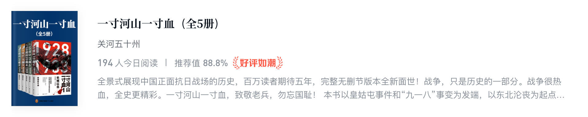

# 读完关河五十州《一寸河山一寸血》

DATE: 2024-05-10

> 豆瓣评分 8.0 左右，88.4 万字，很长。总计耗时 25 天，25 小时 25 分钟。

本书从 1931 年“九一八”事变前的历史背景开始，写到 1945 年日本战败结束，14 年抗日战争（插曲：我读这本书的时候查了一下，原来我国教材在 2017 年的时候已经把 8 年抗战改成了 14 年抗战）。
这本书主要讲的还是战争，基本涵盖了抗日战争所有的战争记录，围绕战争扩展到对应的历史背景和历史人物。

挺不错的一本书，感想挺多，随便写写：

1. 作者作为国人，当然有意识的提高国人的作战水平和降低日本将领的作战水平，争取写成“爽文”，让我们读着不那么难受。但是越是这样越觉得抗战的残酷，在 [这里](https://zh.wikipedia.org/wiki/%E4%B8%AD%E5%9B%BD%E6%8A%97%E6%97%A5%E6%88%98%E4%BA%89%E4%B8%BB%E8%A6%81%E6%88%98%E5%BD%B9%E5%88%97%E8%A1%A8) 可以看到中国抗日战争主要战役列表：
   - 几十场大大小小的战役，中国赢的很少
   - 无论输赢，对日都是以 N:1 的人员伤亡比，多条命换一条命
   - 即便是赢的战役，也是以巨大的伤亡代价换来的
2. 在读本书的同时，搜索了很多相关的历史和人物，包括抗日战争前的国民革命军北伐和解放战争，把民国的历史粗略的串联起来了。重新认识了这段历史：
   - 重新认识了蒋介石，从国民革命军北伐到抗日战争，老蒋在各种国内外势力面前游走，可谓如履薄冰，真的太难了。为中华民族做出了巨大的、不可磨灭的贡献
   - 认识了许多优秀的抗日名将，如：张自忠、宋哲元、傅作义、汤恩伯、卫立煌、张发奎、陈诚、顾祝同、李宗仁、薛岳、王耀武、孙立人等等。还有很多很猛的人，我基本上都看了他们的生平
   - 人性的复杂的，尤其是在乱世。如张自忠、薛岳他们都不是完美的人，会犯错，重要的是在民族危难、国家大义面前没有犹豫过，最终张自忠在方家集激战中以身殉国，意难平。然而张自忠是善战的大将，我们记住了他，在抗日战争中牺牲的千千万的人，他们可能是将军、士兵、老百姓，历史甚至没留下过任何姓名
   - 战争是政治的延伸。政治是极度复杂的，除了要记住在战场上挥泪洒热血的人，还要记住在背后纵横捭阖的人，如顾维钧、萧振瀛等人。再次致敬老蒋
3. _有段总结不好写出来，只可意会_

最后：**一寸山河一寸血，十万青年十万军。铭记国耻，吾辈当自强。**

-------------------------------------------------------------------------------

从棋局上说，即使大部分棋面你都处于优势，但只要有一个地方被人钻了空子，仍然可以致命。

弱国无外交。这句话当然没有错，但我们必须同时知道，就是我们这样的弱国，曾经依靠一批很强的外交家，愣是在丛棘密布的国际外交舞台上杀出过一条条血路。

说到底，这世上的很多东西，大低都属于潜规则的内容，如果你只会从书本到书本，从表面到表面，是永远无法领悟的。

海外知名学者唐德刚曾说，中国近现代史上有两个半外交家。他把其中的一个半留给了晚清的李鸿章和民国的顾维钧，而那最后一个当仁不让就是周恩来。

我们中国人的血液里仿佛天生是缺乏合作这一细胞的，所以上下五千年，内斗向为吾国之传统，而且它是可以由大大小小各种圈子组成的。大到国家，小到斗室，不排出个让自己心服口服的座次来决不罢休。

岁月如同梦境，成功恰似虚幻，而不管你愿不愿意承认，比人更强悍的始终是命运。

有功之臣，心高气傲，驾驭必难，而有过之将，极思补过，即令其效犬马之劳亦不敢轻辞。

我们也许会希望，在人生旅途的每个时段，旁边都有这样一位仁厚而高明的长者相助，或者都有这样允许你改正的机会，那就好了，可惜不是。

人生，总是那么莫测难懂，我们的灵魂时时会失落，我们的内心经常被蛊惑。看着眼前一个又一个被黑夜吞没的轮廓，想想他们也曾高大，也曾无畏，也曾美丽，真有千般滋味在心头。

抗战以来，张自忠是第一位牺牲于正面战场的集团军总司令，有诗赞曰：瞻望南瓜店前路，抗战史上第一人！

1941年12月8日这一天，在得到美国太平洋舰队几乎全军覆灭的消息后，罗斯福气急败坏，赫尔呆若木鸡，可是大洋彼岸的蒋介石却恨不得长跪不起，大叫数声：苍天啊，大地啊，是哪位神仙大姐、耶稣大哥救了我们啊！当天，他在日记上第一次用轻松的笔调写下了一句话：“抗战政略之成就，本日达于极点。”

东西方的思维是如此不同，我们常常一方面说要唯物，另一方面却又强调精神能够变成物质，或者精神可以战胜物资。西方人则是反过来，他们平时也许会执拗地相信上帝的存在，但上阵之后，却绝不会迷信到以为上帝它老人家真的在身边含情脉脉地照应着自己。

这个世上，没有谁能真正毁你，能毁你的，往往正是你自己，所以任何时候都不要把自己当名人给宠着——所谓名人，其实倒过来念，也不过就是一个人名而已。
