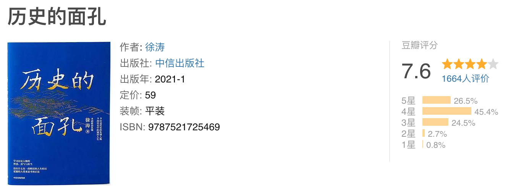

# 读完徐涛-历史的面孔1和2

DATE: 2024-06-16

一共两本书，一周就看完了，主要介绍民国的 15 位历史人物（容闳、梁启超、陈天华、蒋百里、孔祥熙、吴宓、唐绍仪、顾维钧、杨步伟、林则徐、张謇、杨度、秋瑾、辜鸿铭、林徽因）。
有点像《大宋国士》，这种书有点尴尬，因为篇幅有限，作为人物传记太短了，只能说一个大概，围绕着人的事和当时的政治事件就更粗略了。总体感觉一般般。

-----------

下面是书摘：

我特别反对把这种“拒绝”解读为清高或者是看不清现实情况，又或者是看不上这个机会。我更愿意把这次“拒绝”理解为：他的目标实在是太清晰了，一切与其方向不一致的选择都是没有意义的。

个人和圈子的关系其实是一种双向选择。一个人不在某一个圈子里，硬要挤进一个圈子，叫作攀附；一个圈子非要兜住一个人，叫拉拢。只有个人和圈子匹配，浪花站在潮头上，潮头捧起浪花，才能相互成就。

容易做的必定是不重要的，重要的事一定不容易做。但是只有做重要的事，人才会变得重要。那怎么判断什么东西是重要的呢？其实不外乎两个线索：一是组织急需，二是能接触很多人。

思想的革命乃是一个民族乃至一个国家根本性的革命。

在这个世界上，活法看似千千万，归根到底只有两种：做人和做事。

不可替代性往往比一个人的能力更能决定其价值。在那个位置上，你的综合分数是最高的，你就是唯一的，别人无法取代你。

一个人的正直高尚程度，取决于他肯为原则付出的牺牲程度。越是资源少的人，越容易坚持原则，因为他们的原则兑价低，反而容易高估自己的品格，低估资源远远多于自己的人的品格。学生最容易正直高尚，因为他们手上没有任何资源，没有油腻的资格，坚持原则不会让他们失去任何东西。

人生重要的不是结果，而是过程中的体验，没有必要将大把的时间耗费在某一件事情上，做得差不多了，就跳出来尝试做一下其他的事情，这样的人生才丰富多彩。

生命中的一切馈赠，都已在暗中标好了价格。

单方面的知识架构和信息投喂比无知更可怕。

在树立职业目标的过程中，一个立体的、带有人性温度的、活生生的职业榜样，远比一个职业规划的概念，更能撼动年轻的心灵。

世上的一切机会都是属于有心人的，如果我们自己无心长进，大可以抱怨世道不公，但这必定于事无补。人生从来都是靠自己成全的。
