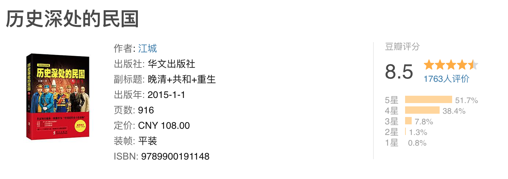

# 读完江城《历史深处的民国》

DATE: 2024-06-04

> 豆瓣评分 8.5，63.5 万字。阅读耗时 18 小时，19 天读完。

本书从鸦片战争（1840）年开始，写到 1949 年新中国成立。和《一寸河山一寸血》相比侧重于政治事件和人物，对于战争写的很粗略。
前半部分较为详尽，越到后面越粗略，尤其是国共内战三年，基本一带而过。整体值得一读，虽然豆瓣评分比《一寸河山一寸血》要高一些，
但我感觉没有后者写的好。

故事重叠比较大，因此感受上与上一个总结区别不大。补充两点感悟：

1. 中国人一向喜欢内斗，这个是几千年传承下来的。但是在家国民族大义面前，能够一致对外也是一种传承。只有小人物会当汉奸，整个民国史都贯穿了军阀内战，斗个不停。
   但是几大军阀没有一个汉奸，而且只要日本打过来的时候，总是可以临时团结起来。
2. 政治本质上都是利益，我记得大学有个外交部的讲座说过政治是世界上最龌蹉的事情。我们常说“苏联老大哥”，在抗日的过程中，苏联给了国共两党非常多的人才和物质帮助，
   但他是希望把日苏的战场放在中国，让中国拖住日本。包括二战期间，美国也是这么想的。还真是没有永远的朋友，只有永远的利益；
3. 最后一点，越看历史，就会越觉得人能活着就挺好的，不要有那么多的乱七八糟的想法，把当下过好就行了。历史充满了随机，你不知道下一刻会发生什么。

-----------

下面是书摘：

在权力面前，资本一旦低下那高傲的头颅，资本与权力就能永享鱼水之欢。

任何自上而下的变法，在新势力没有绝对实力消灭旧势力的时候，一定不要鲁莽急进，而是应该稳健渐进，避免得罪整个既得利益集团。

强度永远战胜广度，就如同找到一个富矿来挖，远比在各个贫矿中这儿挖一块、那儿挖一点强得多。

落水狗如果不打就会变成恶狼。对玩政治的人来说，隐忍和沉寂不是目的，而是手段，它终将爆发在最后那一刻。

从孙中山成立“兴中会”算起到黄花岗起义结束，近十七年的时间里，革命党虽然四处点火，牺牲无数，费了老大的劲，却并未伤到清朝的根本。但令革命党万万没想到的是，数万革命兄弟姐妹十数年来英勇奋斗都没有完成的梦想，摄政王载沣同志凭一己之力胡搞了两年就实现了。

1912年1月1日，孙中山在南京宣誓就职，出任中华民国临时大总统。

心若没有栖息的地方，到哪里都是在流浪。

新中国成立后第一次授衔，十大元帅中的五名--林彪、徐向前、叶剑英、聂荣臻、陈毅，十名大将中的三名--陈赓、许光达、罗瑞卿，均是黄埔军校学生或曾在黄埔军校任职。

想成为大爷，先得学会装孙子。

中国陆军：集团军——军——师——旅——团——营——连——排——班日本陆军：方面军——军——师团——旅团——联队——大队——中队——小队——分队（或称作班）

从1888年李鸿章建立北洋水师，到1895年袁世凯天津小站建立北洋陆军，再到1928年张学良易帜，北洋系统正式退出历史舞台，整整四十年间的中国历史，无处不有北洋的痕迹。

没有任何一个独裁团体能长久地廉洁、激情，这是由权力的本质决定的。一个党派、一个团体垄断了权力，那么它的内部也必然会出现个人垄断权力的冲动，这就必然会引发权力斗争和权力腐败，所以蓝衣社的堕落实属正常。
