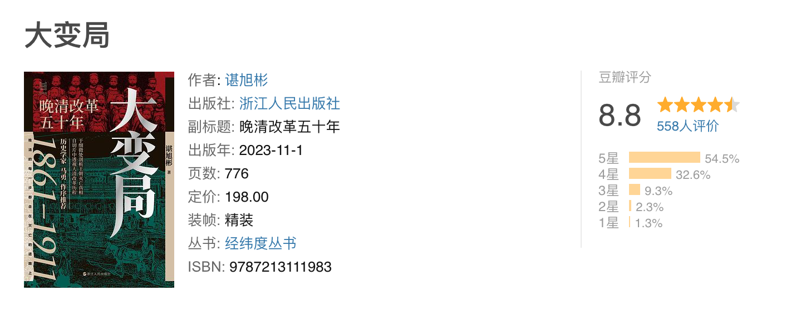
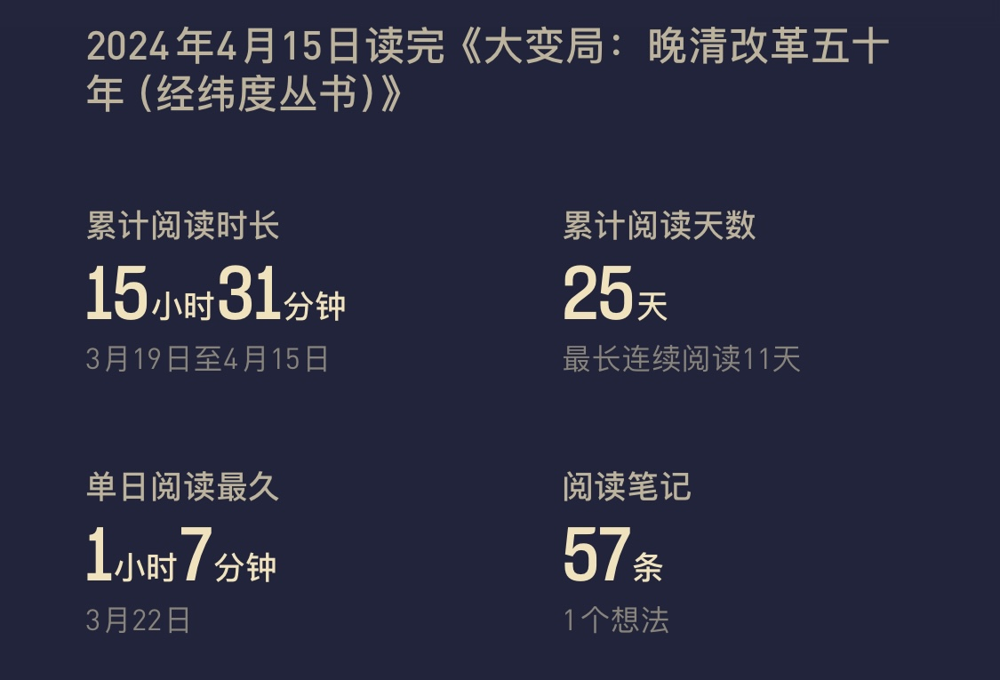

# 读完谌旭彬《大变局：晚清改革五十年》

DATE: 2024-04-15

豆瓣评分：8.8 分

> 1861年，咸丰皇帝逃往承德，并死于避暑山庄。为了壮大国力，摆脱面对西方的弱势局面，在慈禧和奕䜣的带领下，大清王朝开启了自上而下的变革之路。
>
> 改革之路，并非一帆风顺，通过总理衙门的创设、同文馆的建立、近代海关系统的引入、洋务军工企业的创办、外交使团的西行、广学会的成立、
> 废除武举、昆明湖里练兵等事件，大清并未走向愿望中的强大，而是一步步走向了帝国的灭亡。
>
> 在1861-1911这五十年里，有许多历史人物值得关注和研究，如缺乏理政常识的太后、连汉献帝都不如的光绪、
> 被逐离政坛的恭亲王等权谋与争斗不绝如缕的清廷高层；还有深埋改革主张的冯桂芬、选择性“开眼看世界”的斌椿、时代的出局者徐继畬、身陷教案的曾国藩等有挣扎但又怯懦的官僚士大夫；同时也有挑战君权神圣的严复、要做陈涉的官二代谭嗣同等图变图强的有识之士；也有在天下观与国家观的碰撞时，
> 作为惨淡时代中流砥柱，但又困于传统礼教之中难以自拔的乡绅；以及生活本就已经支离破碎、濒临崩溃的底层民众。

## 总结

本书按照年份讲解了晚清最后五十年应对世界走向工业化的道路上的大变局，清朝政府和核心骨干的应对策略。

特色是按照年份，一年一个章节，然而看起来会有点累，因为在章节里会跨年份讲解一些人和事（这也没办法）。
可以了解一个大概，但涉及到很多政治事件比较粗略，如：太平天国、义和团、甲午战争、百日维新等，还需要单独去了解，

整体是一本不错的书，要我评价的话，8.0 差不多，8.8 应该够不上：前 2/3 都是很不错的，到后面感觉差了一点。

对于晚清这段政治的评价，只能说一地鸡毛，错过了太多太多的机会了。天时、地利、人和放一起全都错过了，除了归结于“国运”不行了，也没啥可说的。

## 书摘

本书的主题，是晚清的改革与转型。具体而言，是咸丰十一年(1861)到宣统三年(1911)的改革历程。

朝野普遍使用“庚申之变”这个词，意味着庙堂与江湖皆不得不承认维持传统秩序的努力已经失败，不得不容忍一种不受欢迎而又无力抗拒的新秩序出现在清帝国。

按笔者的理解，晚清改革的终点之所以是辛亥革命，是因为这50年的改革并不是一条不断上升的曲线，而是一条倒U形曲线。其分水岭，也就是倒U形曲线的顶点，是1884年的甲申易枢，慈禧将以恭亲王奕訢为首的军机大臣全班罢免。
曲线的前半段，改革的基本趋势是艰难突破种种阻碍坚持向前；曲线的后半段，改革的基本趋势是减速放缓，最后走向了反改革。改革趋势的这种变化，具体体现为改革主持者与参与者、改革阻力、改革目的与改革对象的变化。

1894年的甲午战争不过是悲剧的开幕，1900年的“庚子之变”才是悲剧的高潮——晚清改革始于“庚申之变”中京城失陷、皇帝外逃的奇耻大辱，最后又回到“庚子之变”的京城失陷、太后携皇帝外逃。历史转了一个40年的大圈，又回到了起点。

第一点感想是，愚民统治虽然有助于维持清政府的利益，但在变革时代，终究会搬起石头砸自己的脚。

1861年，俄国废除了农奴制，美国正深陷南北内战的泥潭。

即便激赏到这般程度，曾国藩还是没有给冯桂芬的书稿写序。所谓学识浅陋不配写序当然只是托词，真正的原因是曾国藩担忧书中的内容会给自己引来麻烦。

所谓“知洋情而胆不足”，即是指冯桂芬对时代的认知已超越了绝大多数人，但他不敢将这种认知做广泛的公开传播。

那许许多多倭仁与杨廷熙，皆是清廷多年以忠孝为核心的愚民政策所刻意培养。如今，这许许多多倭仁与杨廷熙，反成了清廷自强革新的大阻碍。

清廷之所以愿意在长达数十年的时间里默许海关由洋人掌控，一个最重要的原因，是洋人掌控下的新式海关能提供更多的税收。

定都天京后，太平天国在很长一段时期里并未建立起稳定可持续的人力与物力汲取机制。军饷的筹措主要依赖攻陷城池后接管府库银两、没收官绅资产，以及强迫百姓呈缴财富以换取不被抓去当兵的优待。

民众对劳作所产缺乏支配权，其劳作热情必然骤减；当民众开始在土地上磨洋工，仅满足于生产其必需口粮时，必然与天国的征粮系统发生严重冲突。在缺乏民意制衡机制的时代，官僚征粮系统毫无意外将在面对普通民众时拥有绝对优势。事情如此这般发展下去，结局可想而知。

早在明末清初，利玛窦、南怀仁等传教士携西学来华，知识分子们便喜欢以“老子化胡”式的想象来理解西学，以保持对中学的自信。
比如黄宗羲曾说“勾股之术，乃周公商高之遗，而后人失之，使西人得以窃其传”，他发现传教士输入的毕达哥拉斯定理与中国的勾三股四弦五之术相通，遂认定是西方人“窃”了中国的勾股之术。
黄无视了“各自独立发现”的可能，也忽略了理论提炼与现象觉察之间的差别。

内有“学术界”拥护，外有传教士认同，“西学起源于中学”之说很自然地成了康雍乾嘉时代的主流论调。该论调囊括的范围也越来越大，不再仅仅局限于历法。

沿用至今的“自行车”一词正是张德彝创造的。他还记载了避孕套，只是碍于“不孝有三，无后为大”的古训，他表示无法接受这种东西——通常认为，
欧洲人使用的避孕套是16世纪意大利解剖学家法洛皮奥(Gabriele Fallopius)发明的，在1870年前后已经可以批量生产，售价很低廉。张德彝游览欧洲期间，正值避孕套普及之时。

魏源的文化心态是“你的东西虽好，却都是从我这里抄过去的次品”，徐继畬的文化心态则是“我愿意承认你的东西很好，也自信我的东西不错”。

每一个问题，都深深地触及清帝国知识界根深蒂固的自信心，引发他们心理上的抵制与排斥。不愿回答，也不愿解决问题时，最好的办法便是解决掉那个提出问题的人。时代不喜欢徐继畬打开的那个世界，不愿承认那个世界是真的，所以时代主动将徐继畬和他的《瀛寰志略》淘汰出局了。

出使欧美之前，蒲安臣特意为中国制作了一面黄色的国旗：“蓝镶边，中绘龙一尺三长，宽二尺，与使者命驾之时以为前驱。”自此，龙旗成为晚清中国的一个象征。中国也首次以主权国家的面目出现在国际社会中。

**一个人能否获得对事物的正确认知，既取决于他是否有能力获取充分的信息，也取决于他是否拥有处理这些信息的正确思维工具。**

其实，改革的真正阻力从来不在江湖，而在庙堂。

自称“我等不得主意”的慈禧，其实早已打定了主意。“和局固宜保全”是高调的口号不妨多喊，与洋人开战则万万不行；“民心尤不可失”是朝廷不能直接表态说要惩办参与打杀的民众，但这个事要做且不妨交给曾国藩来做。

**对事物的准确认知，来自正确的逻辑与充足的证据。前者提供思维工具，后者提供思维原料。**

自1842年的北京教案，至1911年的长武教案，教民冲突绵延了整整70年，可谓与整个晚清相始终。其持续时间之久、产生纠纷之多、酿成血案之深，同期其他任何外交事件都望尘莫及。教案冲突的结果往往也是双输。

后世的局外人可以用“文明—野蛮”这种二元分析模式，来解释许多历史问题，包括晚清频发的教案。但“可以解释问题”不等于“可以解决问题”。

但容闳不这样认为。他有一个隐秘的愿望，希望将这些幼童培养成近代中国的第一批自由人，不止人身自由，还有精神自由。

以上种种，既不是容闳与幼童们的运气差到了极点，所以遇到的每一任正监督人品都不好；也不是容闳的隐忍还不够，所以每一任正监督都受不了他。而是有病的体制，驱使着这些正监督们必须如此这般去责备容闳。

李鸿章认为，欧美各国虽强，“尚在七万里以外”；日本却不同，它近在咫尺，时刻窥探大清虚实，“诚为中国永远之大患”。

清帝国在1861年定年号为“同治”的含义，既是指两宫太后与恭亲王奕訢共同辅政，也是指爱新觉罗皇室改弦更张，放弃了咸丰时代以高压整肃官僚集团的路线，要与内外满汉群臣共治天下，要“你好我好大家好”。

慈禧是最终决策者，奕訢是信息的处理者和政策的执行者。1872年，曾国藩去世；1876年，文祥去世；1881年，慈安太后去世。奕訢的支持者日渐凋零，他与慈禧之间权力天平的失衡越来越大，晚清改革的舵手，也正由奕訢急速过渡至慈禧太后。

可是，清廷随后急速迈入慈禧时代，也并非幸事——慈禧太后是一位典型的权术有余而见识不足的统治者，“同治中兴”是她的权术所能企及的极限高度。至于引领时代走出变局，已远非她浅陋的见识所能完成。

有见识者权力基础不稳固，权力基础稳固者无见识，这是晚清改革最深的痼疾。

自1876年起，至1878年止，中国北方遭遇了一场旷日持久的罕见旱灾，灾民人数达1.6亿至2亿左右，死于饥荒和疫病的人数至少在1000万人，从重灾区逃亡外地的灾民达2000万人。1877—1878年是灾情最严重的两年，1877年是丁丑年，1878年是戊寅年。所以这场人间惨剧，史称“丁戊奇荒”。

在政府收入与民众温饱之间，清廷的最高决策层，自慈禧、奕訢而下至李鸿章、刘坤一这些地方督抚，均一致选择了前者。鲜有人像郭嵩焘那般，将“民为贵，社稷次之，君为轻”之说当真。

相比救济灾民，朝廷更忧虑洋人此举是在“怀柔远人”，而这原本是大清国才有资格来做的事情。

时代是多面相的，具体的历史人物也是，转型时代的历史人物尤其如此。朝廷失职，以谢家福为代表的民间士绅成了天愁地惨时代里的中流砥柱。但这些中流砥柱，自身也仍困在陈旧的“夷夏之防”里。

1875年，日本禁止琉球入贡中国，禁止受中国册封，禁止奉中国为正朔，要求其奉行明治年号，遵行日本法律，并允许日本派兵驻屯。次年，琉球秘密遣人来华向清廷求援，无果。1879年3月，日本派军警部队强占琉球王宫，将琉球王室送往东京。琉球就此亡国，成了日本的“冲绳县”。

在密室外交模式下，只要事情不碰触爱新觉罗皇室的统治权这一底线，总理衙门总是倾向于少冒一点风险，多做一点妥协。巴夏礼曾将这种路径依赖嘲讽为“心甘情愿对它所受的侵略付出报酬”

朝廷真正的担忧是洋人有了电报线路之后，一方面这会给国防和外交带来麻烦，这与担忧铁路会让列强的军队朝发夕至是相同的思维模式，另一方面担忧生出许多外交事端。

电报线正式进入总理衙门，已是经历了甲午战争之后的1898年。那时，距离丁韪良将电报机带入总理衙门，已过去了29个年头。

西方现代医学传入中国，大约始于嘉庆道光时代。

那个时代最成功的医生，既非传统医学从业者，也非现代医学从业者，而是玩“往传统药方里添加现代药物，后者负责药效，前者负责挣钱”这种新医疗模式之人。

最早对“黄祸论”做出反应并产生巨大社会影响力的人是梁启超。他试图凭借《时务报》的影响力，竭力消弥“黄祸论”和社会达尔文主义带给国人的伤害。在西方知识界的语境里，“黄祸”意味着野蛮和不开化，实质是将中国放置在文明的对立面。梁启超始终坚持中国人与西方人并无二致。

这就是震荡朝野的“甲申易枢”，长期主持晚清改革的恭亲王奕訢，至此被彻底逐出了政坛。

爱读圣贤书者也好，喜欢办洋务者也罢，只要愿意切身介入现实政治，愿意切身接触外部世界，便不难明白什么可以保留，什么应该改革。就像一个人，站在岸上看别人划船，会有许多不切实际的指手画脚；等到自己成了船上的水手，就会明白以前那些指手画脚是多么可笑。

**当一个人以错误的认知和错误的手段，凭着不自知的外部因素竟然取得了成功，那么，在未来，她大概率会将这些错误认知与错误手段当作成功经验，再玩一把。**

严复说，中国的统治者力图使历史停滞在一个特定阶段，因为他们追求的不是社会进步，而是社会平衡。

所谓“湖南腹地自立”，扼要来说，指的是康有为在1897年派门下弟子梁启超、韩文举、叶觉迈等集体入湘，与湘省人士谭嗣同、唐才常、熊希龄等合作，试图以湖南为基地，通过创办学堂、印刷报纸等方式，来谋求“保种保教”。

慈禧之所以急于发动政变，大约是担忧朝廷的人事改革将走向“失控”。她不担忧军机处和总理衙门的中枢大臣，也不担忧张之洞等地方督抚，这些人与她之间的政治联结，远比与光绪皇帝的政治联结紧密。
她最担忧的，是伊藤博文与李提摩太成为光绪皇帝的贴身顾问，他们的背后是日本政府和英国政府，那是慈禧撼动不了的力量。她不能容忍光绪借外国势力与自己争权。

“戊戌六君子”中，杨锐与刘光第二人并非康有为的同道。林旭与康有为的关系则存在摇摆。杨深秀是否知晓康有为等人的惊天策划，也尚缺乏证据。康广仁对康有为的做事方式颇有异议。唯有谭嗣同，高度认同康有为的政治立场

日维新是一场极为错综复杂的改革，它的失败，既不能简单地以“顽固派的镇压”来解释，也非责备康有为“志大才疏”便可使人满意。它实际上是清廷此前30余年洋务改革失败结出来的一枚苦果。
在这场改革里，年轻的皇帝不再信任旧体制；旧体制里的太后与官僚集团也无意响应年轻的皇帝；“改革旗手”康有为在改革启动的前一年，便已萌生出“保中国不保大清”的思想，无论是对年轻的皇帝还是老迈的太后，他都缺乏认同感。

因为有缺陷的制度，实际上是在考验人性。面对可以轻松获取的利益（与非教民打官司），一个人即便从无作奸犯科的历史，也很有可能会突破道德与法律的底线。

对所有的专制政权而言，能够提供稳定的人力与物力汲取的官僚系统，和以重金豢养、能够为政权保驾护航的军队，才是真实的统治基础。舆论和民意可以肆意压制，也可以肆意粉饰，反而并不重要。

科举的本质是以官职为诱饵，引导天下读书人按照朝廷的需要在思想与行为上做自我修正，通过不断生产流水线式的所谓“人才”来维护政权的稳定。

孙很清楚革命是一把双刃剑：革命需要军队，需要集权；但革命的目的又是伸张民权；如何保证革命者革命成功，拥有了巨大权力之后，还能将权力顺利还给民众？他提出的解决方案是“革命之际，先定兵权与民权之关系”，不要等到革命成功之日再来解决这个问题。

清廷亡于慈禧，并不是因为慈禧“害先帝、立幼主，授载沣以重器”，而是她无力有效应对前所未有的时代变局——政治人物对时代的影响与许多因素有关，其中最重要的三点，是见识、权术与实力。
在转型时代，又以见识最为重要。权术与实力决定了影响的力度，见识决定着影响的方向。方向错了，影响的力度越大，损害往往也越大。慈禧太后面对的，恰是一个前所未有的转型时代；她自己也恰是一个有实力、有权术却无见识之

**在这样畸形的社会里苟且太久，苟且会慢慢变成生活的一部分，苟且的原始意味会慢慢消失，苟且会被美化，会变成理所当然和不容置疑。**
